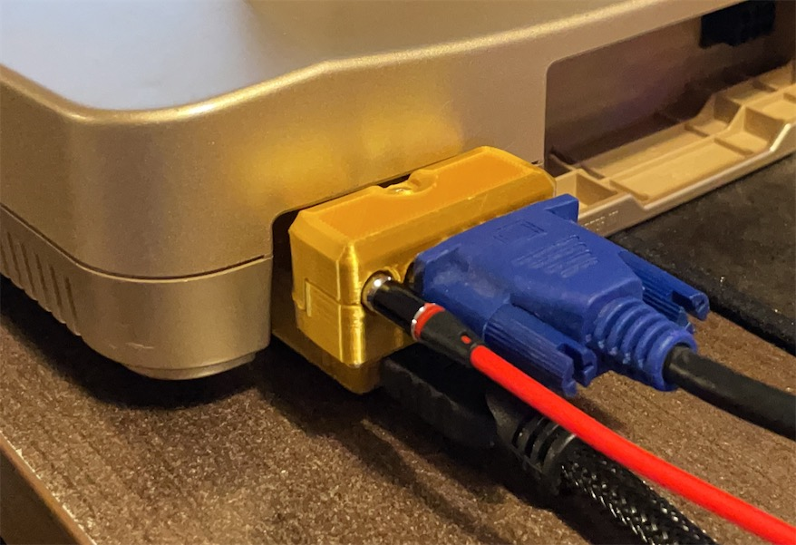

# N64Digital Mini To Full HDMI Adapter

&nbsp;

&nbsp;

This adapter is helpful if you have your Nintendo 64 modded with N64Digital no-cut and you want to output HDMI and analog video at the same (or if you outright hate mini HDMI).

## Companion Projects

### [N64D2WiiComp](../../../N64D2WiiComp)

Output analogue YPbPr component video and digital HDMI signal at the same time.

### [N64D2VGA](../../../SNES2VGA/tree/main/N64D2VGA)

Output analogue RGBS video and digital HDMI signal at the same time.

---------

## Parts

- HDMI Ports - Buy option C1 and A4, plus a 5cm fpv cable. - [Link](https://github.com/jeffqchen/JeffParts/blob/main/Connectors/HDMI/Modular/info.md)

- [2x] M2x20mm screw and nut - [Link](https://github.com/jeffqchen/JeffParts/blob/main/Parts/M2%20M3%20Hex%20Screw%20%26%20Nut/info.md)

---------

## Printing

Print with the ports facing up and with support.

---------

## Assembly

Cable contacts face up. Put the cable in place, then tuck one board on each side.

Try to bend the cable as indicated in the picture, but don't fold them harshly.

Then, slowly press the two halves together. They should mate perfectly.

Lastly, use the screws to finish it up.

---------
Shield: [![CC BY-SA 4.0][cc-by-sa-shield]][cc-by-sa]

This work is licensed under a
[Creative Commons Attribution-ShareAlike 4.0 International License][cc-by-sa].

[![CC BY-SA 4.0][cc-by-sa-image]][cc-by-sa]

[cc-by-sa]: http://creativecommons.org/licenses/by-sa/4.0/
[cc-by-sa-image]: https://licensebuttons.net/l/by-sa/4.0/88x31.png
[cc-by-sa-shield]: https://img.shields.io/badge/License-CC%20BY--SA%204.0-lightgrey.svg
